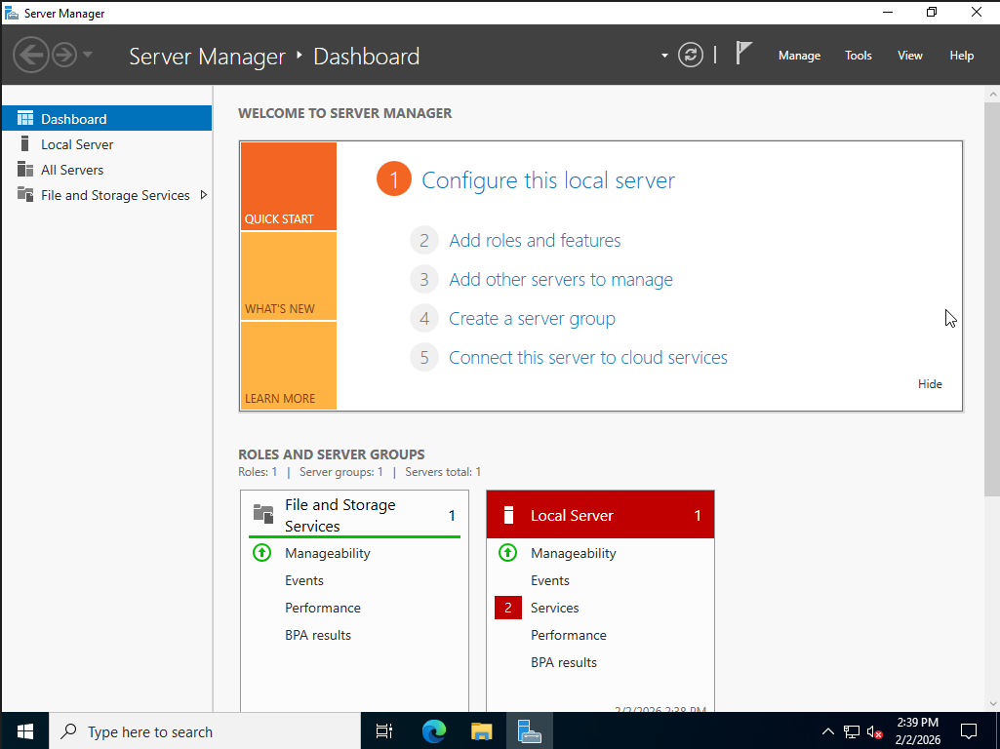
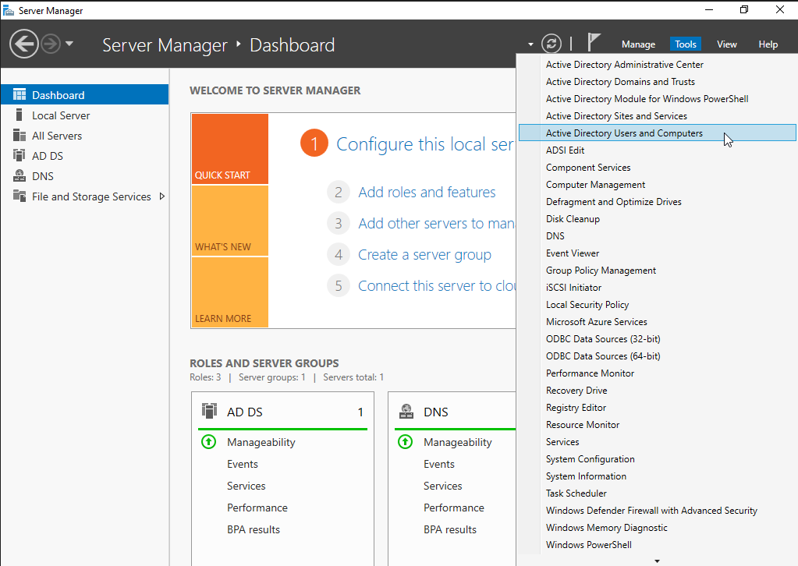
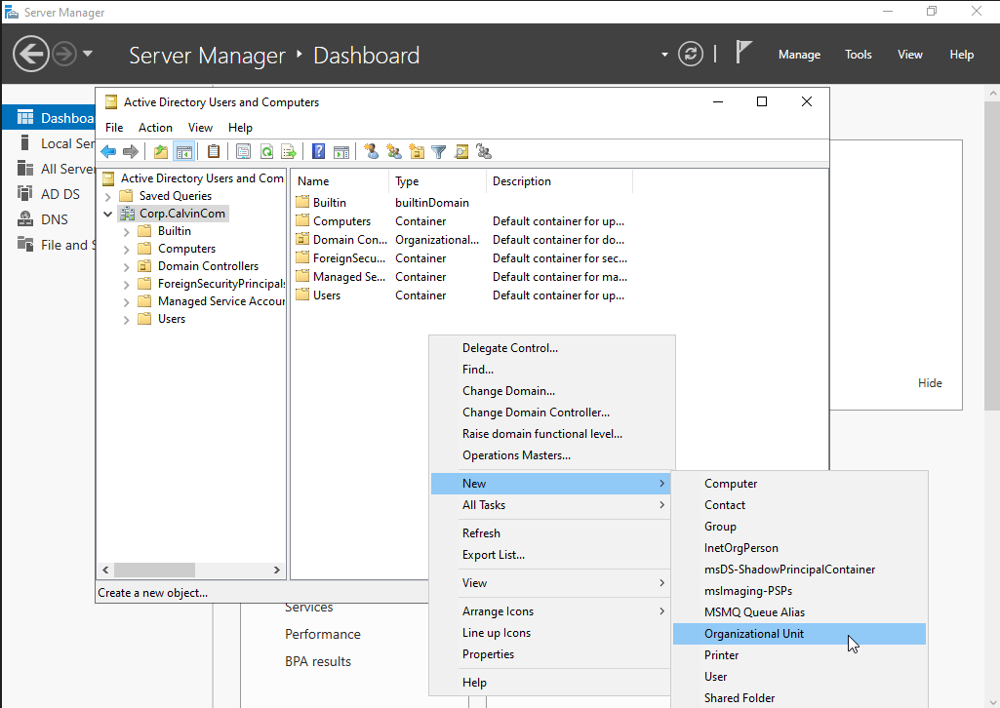
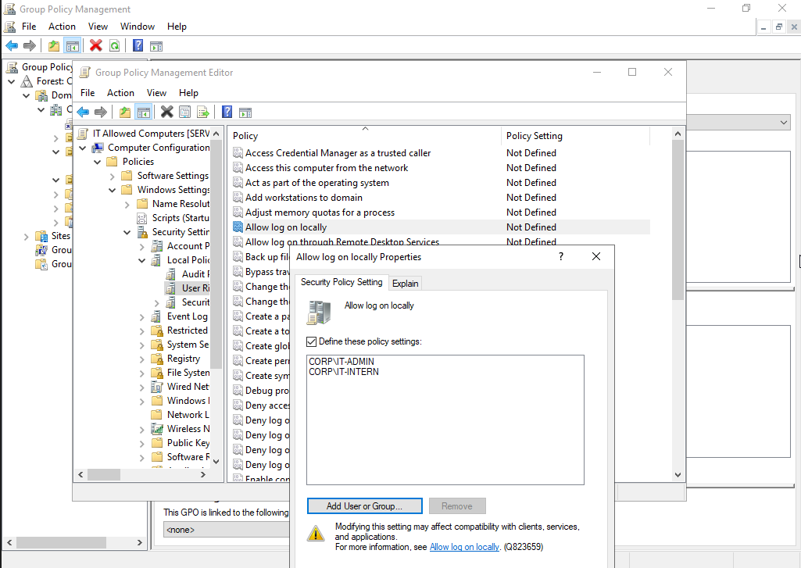
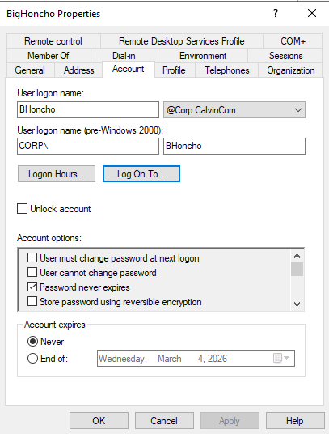
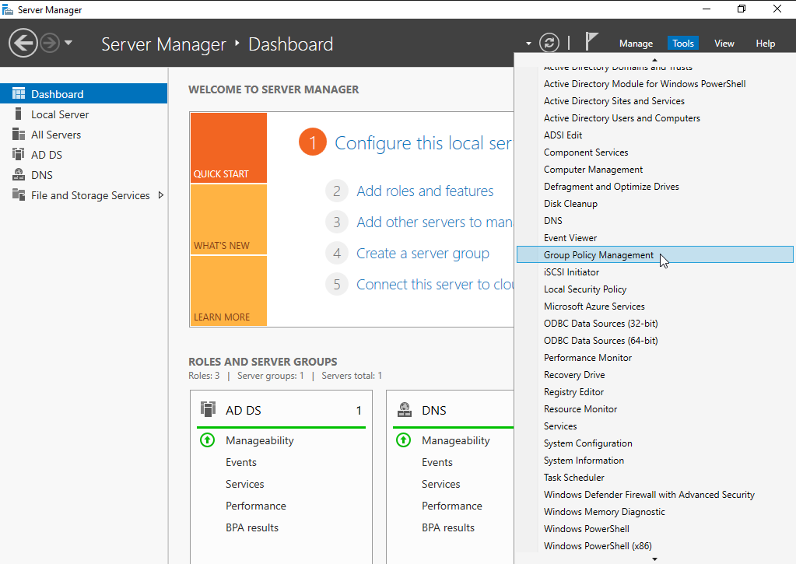
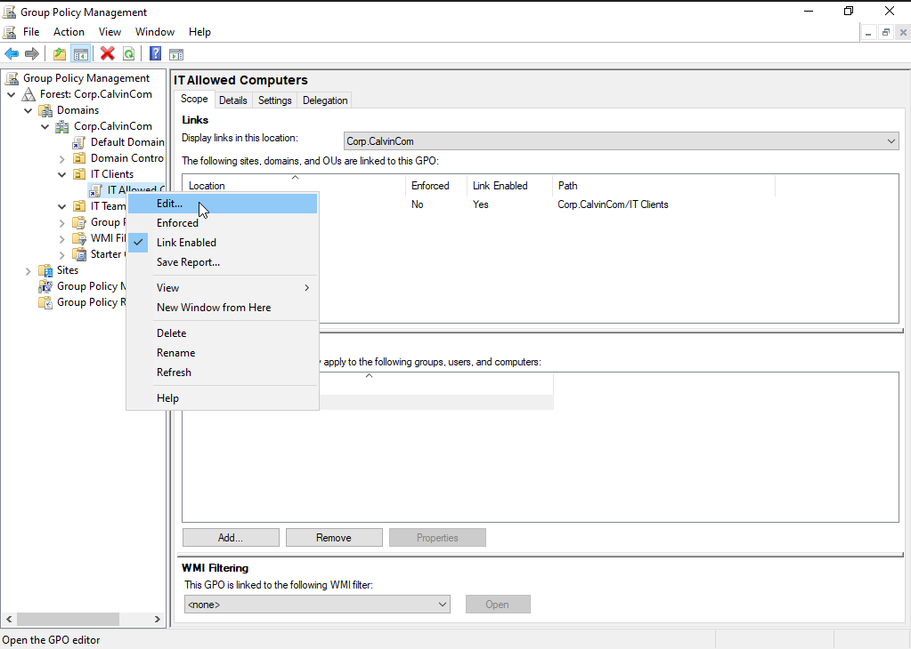
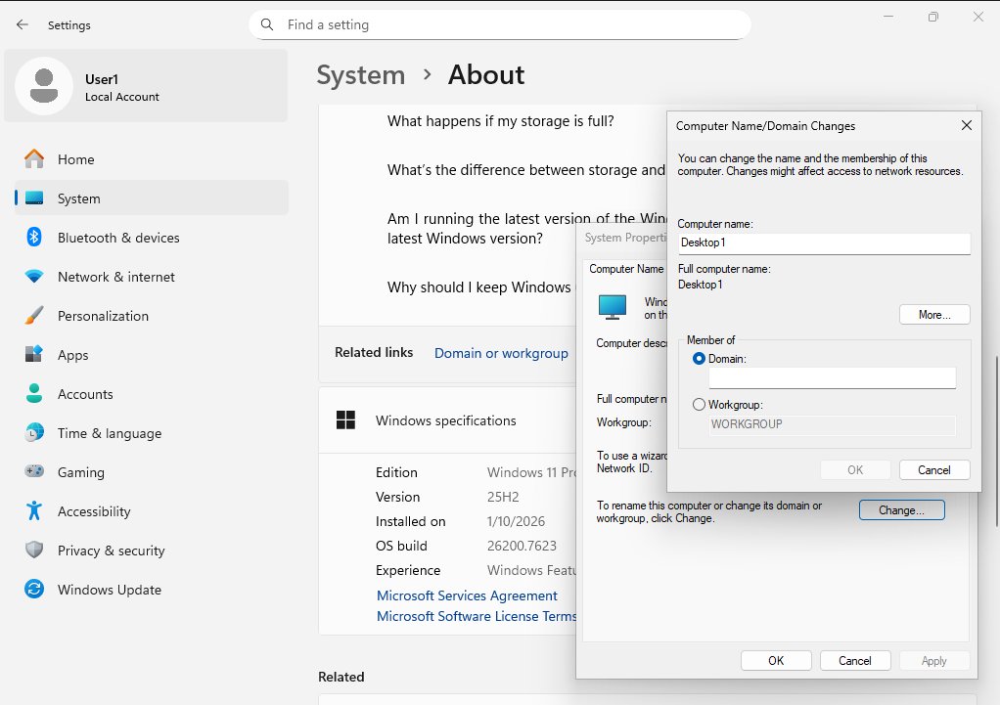
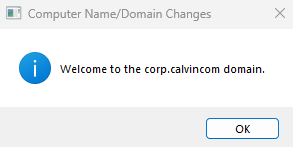

Active Directory (AD) is a centralized directory service used to manage users, computers, and resources across a networked environment. It allows administrators to control access, enforce security policies, and organize systems from a single, consistent framework. By providing authentication, authorization, and structured management at scale, Active Directory simplifies administration, improves security, and ensures consistency across an organization. Its ability to integrate seamlessly with Windows environments and support large, complex infrastructures makes it a reliable and widely adopted solution for identity and access management.

Below, I will document my personal adventure in learning Active Directory, walking through the process of installing and setting up Windows Server 2022, creating a Domain controller, Organization Units, Users, Groups, and some example Group Policy Objects. Hopefully this can act as a reference guide, or give some background information on how Active Directory functions at a high level.

Installing Windows Server 2022:
The first step of setting up an Active Directory for a Windows environment is installing a Domain Controller, typically through Windows Server for a local directory. Alternatives include a virtual domain controller, or cloud based domain controller, such as those offered by Microsoft Azure.

I personally set it up on a virtual machine through VirtualBox, starting from a Windows Server 2022 ISO. The installation process is similar to installing a regular Windows operating system.

I picked the option to install the version with the desktop, as I am more comfortable with a desktop graphical interface. There are alternative options for those more comfortable with the Windows Server to leave out the desktop, opting for a system controlled mainly through command prompt. Once I pick the initial setup options and the operating system is finished installing, I’ll be asked to pick a password for the built-in administrator:

Generally, I’ll want to disable this default administrator account as soon as possible, but for the purposes of this learning adventure, I’ll continue to use it for convenience. Leaving default administrator accounts active can be huge security liabilities in the production environment, as I’ll want to ensure only authorized personnel have access to my Domain Controller.

Once I’ve finalized the account, I’m greeted with a login screen similar to a regular Windows operating system (because I choose the version with the desktop). Once I log in and the system finishes initial setup, I’m greeted with the Server Manager Dashboard.

Domain Controller Setup:

From the dashboard, select the option to “Add roles and features”. I’m taken through a set up wizard, selecting the option for “Role-based or feature-based installation”, and selecting the current system as the location to install my new service. Since I am also going to use this server as the DNS in order to point other clients on this Domain to this server as the Domain Controller, I’ll also enable that role here. I could host DNS separately on a different server, but for this exercise, I am opting to host it all on one VM.

Once the Domain Controller role is designated, I am given a notification that I need to promote this server to a Domain Controller in order to use it. Following the notification, I am led through another setup wizard to begin configuration of my Domain.

 

I’ll be setting this server up as the sole Domain Controller on my newly created domain, creatively named “Corp.CalvinCom”. Note that the domain name is two parts, separated by a period. Just CalvinCom is not a valid root domain name. I am given additional options to configure the controller, such as recovery password or save location for system logs. I left most of those options default for now. After a final review of the settings, I finalize the installation process of this Domain Controller. After a reboot and logging back in, I am finally ready to start configuring my new domain through the Domain Controller.

A quick indication that the domain has been set up and the active directory environment is live is that at log in, I am asked to login not as the local administrator, but the administrator of Corp, the new domain I just created.

OUs, Users, Groups, Clients: 

Once the Domain Controller was fully set up and active, I was able to finally start managing my new domain. From the Server Manager Dashboard, I can select tools and open up the Active Directory Users and Computers configuration pane.

From here, I was able to create organizational units to categorize and organize my hypothetical organization however I’d like. I’m sure I’m only scratching the tip of the iceberg, and each organization has their own ways of how they like to be divided up based on roles, etc. 

I made a few OUs, made some users, and groups to add those users to, it was all fairly simple with the right click context menu.

Groups lets you apply Group Policy rules to entire groups of users, rather than each individual at once, go figure. It’s also easy to look at the properties of each user to figure out what groups they belong to, and other configurations. I probably should remove each user from the default domain group to properly restrict each user’s roles and permissions, but for this demonstration this is good enough for now. I have some hypothetical users belonging to my hypothetical IT team in my hypothetical domain called CalvinCom.

Group Policy Objects: 

So a large part of why I wanted my users organized into groups and organizational units is so I can apply rules to entire groups of users at once. For example, maybe I want to ensure only users that belong on the IT team are able to use the computers in the IT department. One way to do this would be to configure what clients each user is allowed to log onto.

This can work in smaller organisations with few clients, but gets tedious with more users/computers.
Another (and probably better) way would be to configure Group Policy Objects. 

By returning to the dashboard and opening the Group Policy Management pane, I can configure group policies to allow or deny all kinds of permissions or other configurations. (This pane is also accessible via the start menu if I didn’t want to return to the dashboard every time).
I have an OU named IT Clients, where I would put all the actual devices that are in the IT department. From here, I’ll create a new Group Policy Object. I’m about to edit this policy so that only certain groups (like the group I made for my IT team, the IT-ADMIN or IT-INTERN) are allowed to use computers that fall in this OU.

Again, I’ve only scratched the surface of what I’m able to control with Group Policy Objects like this. For example, I can restrict what times certain groups are allowed into their accounts (no logging on after work) or require users to change their password every week, the list goes on. 

Joining Clients to the Domain: 

Now what good is a domain of just one computer, the controller? Not much. The entire point of Active Directory is to have a centralized point to manage other clients and users.I’ll be skipping over how to fulfill some of the networking requirements, such as being on the same LAN (or VLAN, for those remoting in via VPN), for now. Just assume that clients are connected directly to the same local network as the domain controller, to simplify things for now. 

On a client machine looking to join the domain, I need to manually connect to the domain. To do this, on a windows 11 (virtual) machine, I went from Settings > System, looking for the “Domain or workgroup” option.

(There are other ways to get to this menu, such as searching for system properties, etc)
I could join the domain by typing in the IP of the Domain Controller manually, or I could configure the client’s DNS to point to the domain first. This will also have the added benefit of having name resolution for any other local servers, like storage or email enabled for the future. 
Once the client’s DNS settings are properly configured, I am able to simply enter in the Domain Name to join the domain. In my case, that’s “Corp.CalvinCom”.

The client should restart, and once it finishes booting, I am able to log into the domain using one of the users I already created for my domain.

